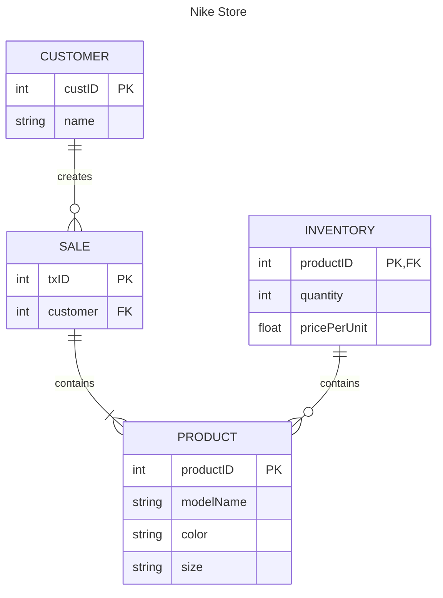

```mermaid

---
title: Nike Store
---

erDiagram
    PRODUCT {
        int productID PK
        string modelName
        string color
        string size
    }

    CUSTOMER {
        int custID PK
        string name
    }

    SALE {
        int txID PK
        int customer FK
    }

    INVENTORY {
        int productID PK, FK
        int quantity
        float pricePerUnit
    }

    CUSTOMER ||--o{ SALE : creates
    SALE ||--|{ PRODUCT : contains
    INVENTORY ||--o{ PRODUCT : contains

```

### Entities
- PRODUCT:
- CUSTOMER:
- SALE:
- INVENTORY:

### Relationships
- CUSTOMER -> SALE:
