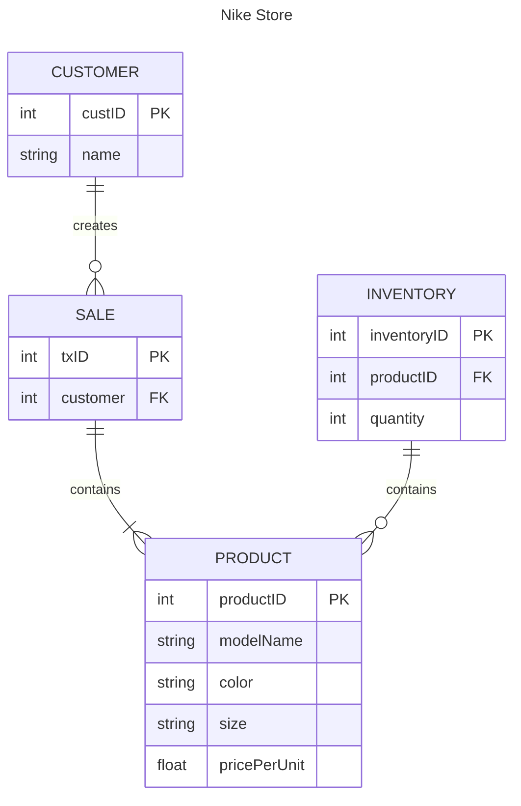

### Entities
- PRODUCT: This represents a pair of Nike shoes of a particular model, size, and color.
- CUSTOMER: This represents a customer that purchases shoes from the Nike store.
- SALE: This represents a purchase of 1 or more pairs of Nike shoes by a customer.
- INVENTORY: This represents the quantity available for each product.

### Relationships
- CUSTOMER -> SALE: This relationship represents a customer creating a sale by buying 1 or more pairs of shoes.
    _This supports business operations, providing a means to understand who is purchasing the products._
- SALE -> PRODUCT: This represents the products that the customer is buying in each transaction.
   _This supports business operations, allowing products to be sold._
- INVENTORY -> PRODUCT: This represents the store inventory by associating each product with a quantity.
   _This supports business operations, allowing us to understand how many of each of the products we have available._

